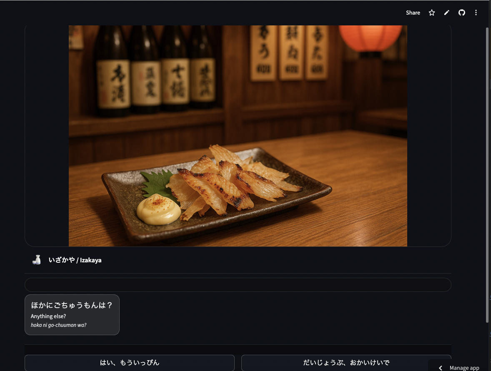

# Izakaya Conversation Simulator 🍶

A travel conversation simulator built with **Python (Streamlit)**.  
Practice Japanese conversation in local situations like an **izakaya** (Japanese pub),  
with choices displayed in **Japanese (hiragana), English, and romaji**.

---

## 🚀 Demo

👉 [Live Demo on Streamlit Cloud]([https://your-deploy-link-here.streamlit.app](https://zitatori-izakaya-simuator-app-szf4r5.streamlit.app/))  

---

## 📸 Screenshots

### Ordering Menu


---

## ✨ Features
- Visual novel–style UI with big background images
- NPC and user dialogue bubbles
- Choices in **Japanese / English / Romaji**
- Background and overlay images (hand raise, finger signs, payment signs)
- Fallback background (`izakaya1.jpg`) if others are missing
- Simple state engine with `dataclass` for scenarios

---

## 🛠️ Tech Stack
- [Python 3.10+](https://www.python.org/)
- [Streamlit](https://streamlit.io/) for UI
- GitHub for version control / deployment

---

## 🔧 Installation
Clone this repo and install dependencies:

```bash
git clone https://github.com/your-username/izakaya-sim.git
cd izakaya-sim
pip install -r requirements.txt
